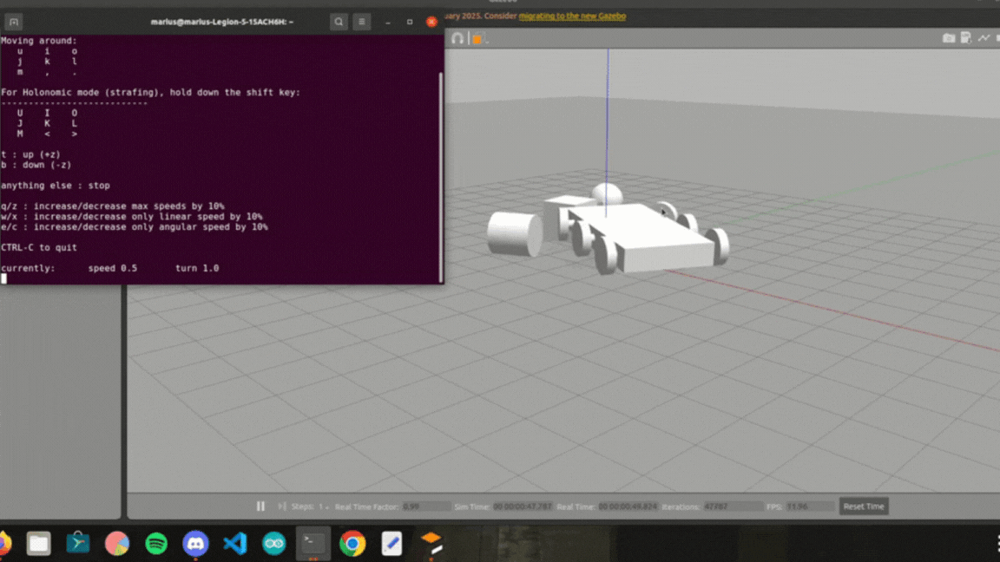

# Autonomous Robot Simulation using ROS and Gazebo

## Overview
This repository provides a complete ROS/Gazebo setup for simulating a six-wheeled robot with steerable front wheels. The robot is defined via a URDF Xacro file, can be controlled with a custom teleop node, and launched into a custom Gazebo world. A demonstration GIF (`robot_gazebo.gif`) shows the robot driving and steering in Gazebo.

## Repository Structure
```
├── urdf/
│   └── robot.urdf.xacro               # Robot description (6WD, steerable front wheels, camera, laser)
├── src/
│   └── teleop_twist_keyboard_custom.py  # Keyboard teleop node for cmd_vel
├── launch/
│   └── 6wd_gazebo.launch              # Launch file to spawn robot in custom world
├── robot_gazebo.gif                   # GIF demonstrating the robot in Gazebo
└── README.md                          # This file
```

## Robot Description (URDF/Xacro)
- **File**: `urdf/robot.urdf.xacro`  
- Defines a rectangular base link (4 m × 2 m × 0.5 m) named `base_link`.
- Six wheel links (`cylinder0`–`cylinder12`), where:
  - **Front-left & front-right wheels** are mounted on steerable joints (`front_left_steer_link` and `front_right_steer_link`), each with a revolute joint allowing ±45° steering.
  - **Four rear wheels** (`cylinder1`, `cylinder2`, `cylinder4`, `cylinder11`) are fixed to the base via continuous joints (drive only).
  - **Additional small wheels** (`cylinder5`–`cylinder10`, `cylinder12`) simulate caster/support wheels.
- A fixed camera link (`camera_link`) mounted at `(2, 0, 0.3)` with a Gazebo camera sensor plugin publishing image topics under `/camera`.
- A fixed laser link (`laser_link`) at `(2, 0, 0.3)` with a Gazebo laser (LiDAR) sensor plugin publishing on `/scan`.
- The `planar_move` plugin (`libgazebo_ros_planar_move.so`) is attached to `base_link`, subscribing to `/cmd_vel` for 2D locomotion.

## Teleop Node
- **File**: `scripts/teleop_twist_keyboard_custom.py`  
- A Python script that publishes `geometry_msgs/Twist` messages on the `cmd_vel` topic based on keyboard input:
  - **Movement Keys**:
    - `i`: forward  
    - `,`: backward  
    - `j`: turn left  
    - `l`: turn right  
    - `u`, `o`, `.`, `m`: diagonal/combined motions  
  - **Speed Adjustments**:
    - `q` / `z`: increase/decrease both linear and angular speed  
    - `w` / `x`: increase/decrease linear speed only  
    - `e` / `c`: increase/decrease angular speed only  
  - Pressing `CTRL-C` exits and stops the robot.

## Launch File
- **File**: `launch/6wd_gazebo.launch`  
- Workflow:
  1. **Generate URDF**: Runs Xacro on `robot.urdf.xacro` and sets the `robot_description` parameter.
  2. **robot_state_publisher**: Publishes TF frames for all links/joints.
  3. **spawn_model**: Spawns the `robot` into Gazebo at position `(x=5, y=0, z=0)`.
  4. **Gazebo Initialization**: Includes `gazebo_ros/empty_world.launch` with:
     - `world_name`: `my_custom_world.world`  
     - `use_sim_time`: `true`  
     - `paused`: `false`  
     - Extra verbose flags.

## Requirements
- **ROS Noetic** (or Melodic; adjust package names accordingly)
- **Gazebo** (compatible with your ROS distribution)
- `ros_control` plugins (for joint interfaces)  
- `gazebo_ros_pkgs`  
- Python 3 with `rospy`

Install prerequisites (Noetic example):
```bash
sudo apt update
sudo apt install ros-noetic-desktop-full ros-noetic-gazebo-ros-pkgs ros-noetic-ros-control ros-noetic-ros-controllers python3-rospy
```

## Usage

1. **Build and Source Your Workspace**  
   ```bash
   cd ~/catkin_ws
   catkin_make
   source devel/setup.bash
   ```

2. **Launch Gazebo with the Robot**  
   ```bash
   roslaunch <your_package_name> 6wd_gazebo.launch
   ```
   - Gazebo will open `my_custom_world.world` and spawn the six-wheeled robot at `(5, 0, 0)`.
   - The robot’s camera and laser sensors will be active, and it will listen on `/cmd_vel`.

3. **Control the Robot via Keyboard**  
   In a new terminal (source the workspace):
   ```bash
   source ~/catkin_ws/devel/setup.bash
   rosrun <your_package_name> teleop_twist_keyboard_custom.py
   ```
   - Use the keys described above to drive and steer the robot in Gazebo.
   - The planar move plugin converts `Twist` messages into planar motion.

## Demonstration

  
*The robot driving, steering, and sensing in Gazebo.*

## Troubleshooting
- **URDF Errors**: Ensure `xacro` is installed:  
  ```bash
  sudo apt install ros-noetic-xacro
  ```
- **Missing Plugins**: Verify that `libgazebo_ros_camera.so`, `libgazebo_ros_laser.so`, and `libgazebo_ros_planar_move.so` are available under your `gazebo_ros_pkgs` installation.
- **Control Issues**: If the robot does not respond to `/cmd_vel`, check that:
  - The planar move plugin is loaded (look for messages in Gazebo console).
  - The teleop node is publishing on `cmd_vel` (`rostopic echo /cmd_vel`).

## Contact
For questions or feedback, please reach out to:  
**mariusc0023@gmail.com**
